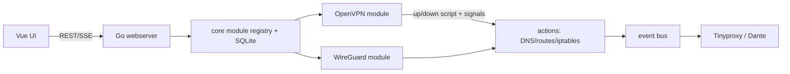

# VPN Sandbox Agent Guide

## Project overview

VPN Sandbox is a Linux container that routes traffic through a user-configured OpenVPN or WireGuard tunnel and exposes optional HTTP (Tinyproxy) and SOCKS5 (Dante) proxies plus a browser UI. It is intended for running applications or proxy clients behind a VPN. The runtime is an Alpine image and needs `/dev/net/tun` and `NET_ADMIN`; route, DNS, and iptables changes are therefore container-sensitive and security-critical.

The daemon is Go (`server/`, module requires Go 1.26.5) with Gorilla Mux and SQLite. The UI is unbundled Vue 3 loaded from CDNs with Bulma and Font Awesome. The small project has one Go unit test and a manual/container network harness; do not assume broad automated coverage.

## Repository map

- `server/main.go` — daemon entry point, CLI flags, OpenVPN script mode, signal handling, startup order, module initialization.
- `server/core/` — global paths/config, SQLite connection and `configs` table, module interface/registry, default module behavior. Configuration database: `/data/config/vpn-sandbox.db`.
- `server/actions/` — VPN up/down side effects: DNS, default routes, firewall rules, app lifecycle. Treat changes here as potentially disruptive.
- `server/modules/openvpn/`, `wireguard/` — persistent VPN server templates and tunnel/process lifecycle. Their `api.go` files add server-template routes; `db.go` owns each module table.
- `server/modules/proxy/` — Tinyproxy and Dante runtime configuration, process lifecycle, and reactions to VPN/global-config events. `usr/local/etc/*.conf` are source templates copied into the image.
- `server/webserver/webserver.go` — REST/SSE routes and static serving. Module routes are registered here through `core.Module`.
- `server/utils/` — argument parsing, logging, process/signal helpers, event bus, filesystem and network helpers. Reuse these patterns.
- `server/static/` — UI entry HTML, dynamic SFC loader, and Vue components. `components/app/` is the screen-level UI; `config/` and `core/` are reusable editors/primitives.
- `Dockerfile` — two-stage Go/Alpine image build and installed runtime tools. `docker-compose.yml.example` is an example stack that routes FlareSolverr through the VPN container.
- `Makefile` — Podman build/run shortcuts and Docker-based test harness shortcuts. `test/` contains the privileged manual test container and `cmd.sh` setup/network mock script.
- `README.md` — user installation, deployment, proxy, and `/data` guidance. `CHANGELOG.md` is release history.
- `3rd-party/` — third-party source/license material; do not edit for product changes.

No nested agent-instruction files were found during this refresh.

## Architecture and flow

- Startup initializes `/data/config` and `/data/var`, opens SQLite, restores saved global configuration, applies `VpnDown()` to establish the disconnected firewall state, registers proxy/OpenVPN/WireGuard modules, then serves HTTP (default port `80`).
- Module configuration is stored as JSON in `configs`. OpenVPN and WireGuard server templates/credentials are separate SQLite tables; generated runtime files and logs are under `/data/var`. Do not expose `.auth` files.
- OpenVPN invokes the executable as its up/down script. Script mode records OpenVPN environment data, signals the main process, and that process applies network policy. WireGuard creates `wg0` and invokes the same VPN-up/down actions directly.
- `vpn-up`, `vpn-down`, and global configuration events are asynchronous. Proxies start only when enabled and a VPN is up; they stop on VPN-down. SSE `/api/status` pushes refreshed status to the UI.
- There is no application-layer authentication or authorization on the web/API routes. Deployment must restrict published management/proxy ports to trusted networks.

## Entry points and commands

Run commands from the repository root unless stated otherwise. The project fully supports both **Docker** and **rootless Podman**. The `Makefile` targets use `podman` by default, but Docker users can run the equivalent `docker` or `docker compose` commands directly.

- Build image: `make build` (uses `podman build -t vm75/vpn-sandbox .`).
- Run development stack: `make run` (uses `podman compose up -d`). Use `make clean` to tear down. You can also use `make start`, `make stop`, `make logs`, and `make sh` to interact with it.
- Run development image: `make test` (Podman; mounts `./test` to `/data`, publishes UI/proxy ports). It does not add `/dev/net/tun`; use the Compose setup when a real VPN tunnel is needed.
- Start/stop the manual test environment: `make test-start` / `make test-stop` (delegates to `test/cmd.sh`, requires Docker). `make test-start` opens an interactive shell in the `test` container after setup.
- Run all Go tests: `cd server && go test ./...`.
- Run the existing focused test: `cd server && go test ./utils -run '^TestArgParse$'`.
- Build only the daemon: `cd server && CGO_ENABLED=1 go build .` (CGO is required by `go-sqlite3`).

No formatter, linter, type-checker, migration runner, frontend package manager, or code-generation command is configured. Use `gofmt -w` on changed Go files; do not invent npm or migration workflows. Host Go was unavailable during this refresh, so Go build/test execution was not performed.

## Configuration, data, and deployment

- CLI flags are parsed in `server/main.go`: `--data`/`-d` (default `/data`), `--port`/`-p` (default `80`), `--test`, and `--sudo`. The image entrypoint uses defaults.
- `/data` is the persistent mount: `config/` contains SQLite; `var/` contains generated VPN/proxy configs, PID files, logs, and credentials; optional executable `/data/apps.sh` receives `setup`, `up`, and `down`.
- The container image supplies VPN/network/proxy binaries and the source proxy templates. Its `NET_ADMIN` capability and `/dev/net/tun` device are required for real VPN operation.
- `docker-compose.yml.example` recognizes FlareSolverr settings such as `LOG_LEVEL`, `LOG_FILE`, `LOG_HTML`, `CAPTCHA_SOLVER`, and `TIMEZONE`; they belong to the sidecar, not the Go daemon.
- Never commit `/data` contents, VPN templates with credentials, generated `*.auth`, private keys, tokens, or production database copies. WireGuard temporarily writes `/tmp/wg0.key` during tunnel setup; preserve the cleanup behavior.

## Coding conventions

- Keep changes small and follow the existing package/module boundaries. Register a new module through `core.RegisterModule` and implement `core.Module`; use `core.DefaultModule` only when its database-backed behavior fits.
- Use `core.DataDir`, `ConfigDir`, `VarDir`, and `AppScript` for daemon paths. Create schema with `CREATE TABLE IF NOT EXISTS`; access the shared `core.Db` rather than opening ad hoc connections.
- Prefer `utils.RunCommand`/`StartCommand` for process execution and `utils.LogError`/`LogFatal`/`LogLn` for operational logging. Existing proxy code directly creates `exec.Cmd`; do not expand that exception without need.
- Preserve the event model: publish named events after state changes and keep listeners safe for asynchronous delivery.
- UI `.vue` scripts must use `export default { ... }`. The custom loader extracts template/script/style via regex, so avoid `defineComponent` and nonstandard export formatting. Nested components use `Vue.defineAsyncComponent(() => ComponentLoader.import(...))`; keep component CSS in its trailing `<style>` block and use Bulma conventions.
- Keep API behavior consistent with the existing JSON handlers and module route registration. Validate request data and return appropriate HTTP errors when adding or touching endpoints.
- Format Go with `gofmt`. There is no configured JS formatter/linter; match surrounding style.

## Testing and change guide

Add or update focused tests when behavior changes; if network/container behavior cannot be automated, state why and validate it in `test/` where feasible. The only committed Go unit test is `server/utils/arg_parse_test.go`. The `test/cmd.sh` harness performs privileged route/DNS/iptables mocks and starts simple port-80/81 servers; it is not a standard assertion-based test suite.

- API or module change: inspect `server/webserver/webserver.go`, `server/core/module.go`, and the target module's `main.go`/`api.go`; add UI calls/components where user-visible.
- New persisted field or table: inspect `server/core/db.go`, target `db.go`, module config load/save methods, and UI editors. Maintain backward-compatible initialization for existing SQLite files; no migration framework exists.
- VPN routing/DNS/firewall behavior: inspect both `server/actions/vpn_up.go` and `vpn_down.go`, plus OpenVPN script flow or `wireguard/tunnel.go`. Test only in an isolated privileged container; incorrect order can cut off access or leak traffic.
- Proxy behavior: change the module plus its template in `usr/local/etc/`; verify interactions with VPN events and optional proxy credentials.
- UI behavior: start at `server/static/components/app/app.vue`, follow async imports, and inspect `component-load.js` before changing SFC structure.
- Dependency/runtime tool change: update `server/go.mod`/`go.sum` or `Dockerfile` as appropriate, then build the image. Do not manually edit `go.sum`.
- Deployment or user workflow: inspect `Dockerfile`, `docker-compose.yml.example`, `Makefile`, `README.md`, and `test/docker-compose.yml` as applicable.

## Restricted/generated files and documentation

- `server/go.sum` is generated by Go module tooling; do not hand-edit it.
- `/data/config/vpn-sandbox.db`, `/data/var/`, generated VPN/proxy configs, PID files, logs, and auth files are runtime state and must not be committed.
- `3rd-party/` is third-party material. `docs/screenshots.gif` and visual assets should change only when intentionally updating project presentation.
- Network commands, iptables flushing, default-route changes, `pkill`, and app scripts are operationally sensitive. Avoid running them on the host; target only the intended container/test namespace.
- At the end of a behavior, configuration, architecture, command, or deployment change, review both `README.md` (users) and this file (agents). Update only when needed and explicitly say when review found no documentation change. Keep them consistent.

## Completion checklist

1. Read this guide first, then inspect only the named files relevant to the task.
2. Review the final diff; remove unrelated edits and debugging artifacts.
3. Run the smallest relevant test, then broader Go tests/image build or the privileged harness when applicable.
4. Verify configuration defaults, persistence compatibility, and route/firewall effects for network changes.
5. Run `gofmt` for changed Go code; use configured tooling only.
6. Check that no credentials, private keys, database state, or generated files were added.
7. Review/update `README.md` and `AGENTS.md` when the change affects their scope, and report validation plus remaining risks.

Apply KISS, YAGNI, and minimal scope: do not add speculative abstractions, broad refactors, configuration switches, or dependencies. Use targeted searches and focused tests rather than loading or processing the whole repository.
