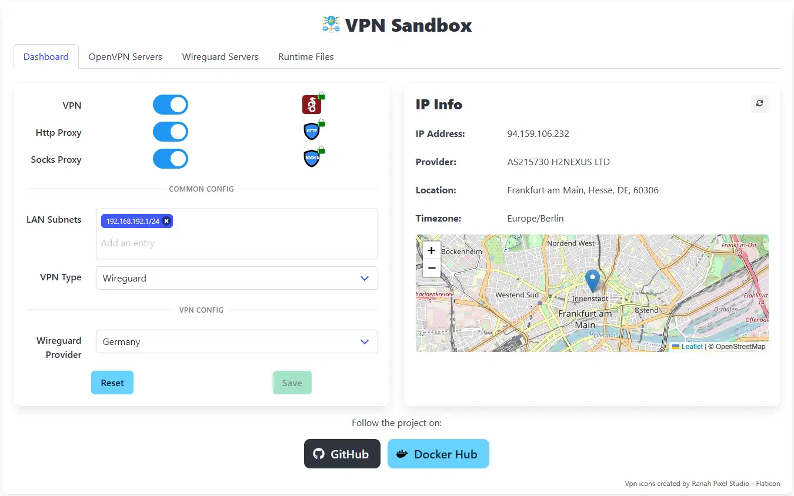

# VPN Sandbox

[](LICENSE)
[](https://hub.docker.com/r/vm75/vpn-sandbox)
[](https://github.com/vm75/vpn-sandbox/actions)

**VPN Sandbox** is an open-source containerized solution for securely tunneling network traffic through a VPN. It supports **OpenVPN** and **WireGuard**, with features like **HTTP Proxy** and **SOCKS Proxy** support, DNS leak prevention, and a web-based interface for easy configuration. The container runs in **rootless mode** and is ideal for secure browsing or running custom applications behind a VPN.

<p align="center">
  
</p>

## Key Features

- **Supports OpenVPN and WireGuard**: Choose between two popular VPN protocols for your secure connection needs.
- **Rootless Container Support**: Run the container without elevated privileges, enhancing security.
- **HTTP and SOCKS Proxy**: Redirect host network traffic through proxies to browse securely.
- **Web-Based Configuration UI**: Configure VPN servers and manage settings via an intuitive web interface.
- **Template-based Server Configuration**: Create and manage server configurations using templates.
- **Prevention of DNS Leaks and LAN Access**: Ensures that DNS queries do not leak and blocks direct LAN traffic for enhanced privacy.
- **Custom App Support**: Execute custom scripts or applications when the VPN connection is established.

## Getting Started

### Prerequisites

- Install Docker or Podman.
- Configure a persistent volume for `/data`.

### Quick Start

Pull the Docker image and run the container:
```bash
docker pull vpn-sandbox/vpn-sandbox
docker run -d --name vpn-sandbox \
  --cap-add=NET_ADMIN \
  --device=/dev/net/tun \
  -v /path/to/data:/data \
  -p 8080:80 \
  vpn-sandbox/vpn-sandbox
```

### Example `docker-compose.yml`
Here's an example configuration for Docker Compose:
```yaml
services:
  vpn-sandbox:
    image: vpn-sandbox/vpn-sandbox
    container_name: vpn-sandbox
    cap_add:
      - NET_ADMIN
    devices:
      - /dev/net/tun
    ports:
      - "8080:80"   # Web UI
      - "1080:1080" # SOCKS Proxy
      - "3128:3128" # HTTP Proxy
    volumes:
      - /path/to/data:/data
    restart: unless-stopped
```

Start the service with:
```bash
docker-compose up -d
```

## Server Configuration

To add a new server, use the web interface to create a new server configuration. It supports **OpenVPN** and **WireGuard** configurations.

The configuration templates can include custom parameters, such as endpoints, IP addresses, and ports. There can be multiple sets of values for each template. The parameters are enclosed in double brackets `{{}}`.

## Volume Structure

The `/data` volume should contain the following structure:
```plaintext
/data
├── config/         # Contains the sqlite3 database
├── var/            # Contains the runtime configuration and logs
├── apps.sh         # Custom apps script (optional)
```
It is recommended to place the `apps.sh` script in the `/data` volume.

### Example `apps.sh` Script (optional)
This script runs custom applications once the VPN connection is established:
```bash
#!/bin/sh

case "$1" in
  setup)
    apk --no-cache --no-progress <packages needed by apps>
    ;;
  up)
    # Run your custom apps here
    ;;
  down)
    # Stop your custom apps here
    ;;
esac
```

Ensure the script is executable:
```bash
chmod +x /data/apps.sh
```

## Web UI Access

The web UI is accessible at `http://<host-ip>:8080` by default. Use it to configure your VPN servers and settings with ease.

## Proxy Usage

Configure your browser or applications to use the container's HTTP (`3128`) or SOCKS (`1080`) proxies to securely route traffic through the VPN.

## License

This project is licensed under the MIT License. See the [LICENSE](LICENSE) file for details.

### 3rd-Party Components

<table>
  <tr>
    <th>Component</th>
    <th>License</th>
  </tr>
  <tr>
    <td>
      <a href="https://openvpn.net/">OpenVPN</a>
    </td>
    <td>
      <a href="3rd-party/openvpn/COPYRIGHT.GPL">COPYRIGHT.GPL</a>
    </td>
  </tr>
  <tr>
    <td>
      <a href="https://www.wireguard.com/">WireGuard</a>
    </td>
    <td>
      <a href="3rd-party/wireguard/LICENSE">LICENSE</a>
    </td>
  </tr>
  <tr>
    <td>
      <a href="https://www.inet.no/dante/">Dante (Socks Proxy)</a>
    </td>
    <td>
      <a href="3rd-party/dante/LICENSE">LICENSE</a>
    </td>
  </tr>
  <tr>
    <td>
      <a href="https://tinyproxy.github.io/">Tinyproxy (HTTP Proxy)</a>
    </td>
    <td>
      <a href="3rd-party/tinyproxy/COPYING">COPYING</a>
    </td>
  </tr>
</table>

---

**VPN Sandbox** provides a simple, secure, and flexible way to manage VPN connections using containerization. Contributions are welcome! 🚀